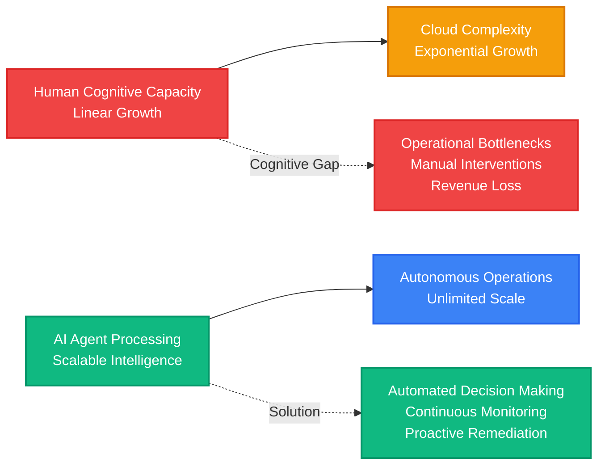
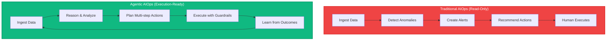
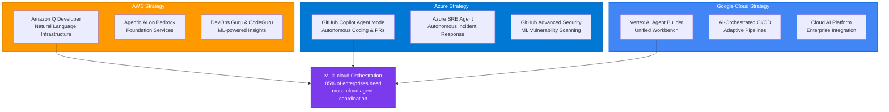
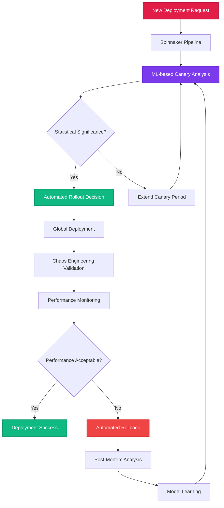
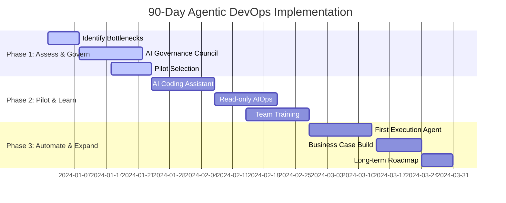
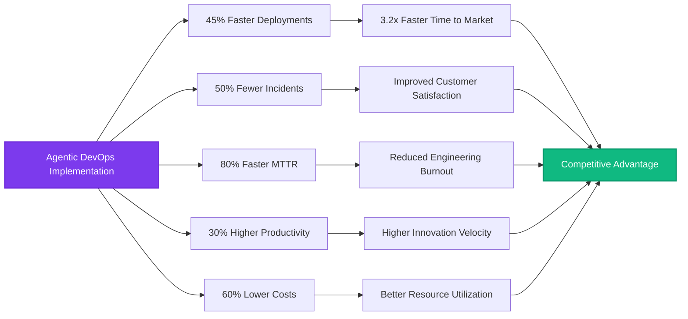
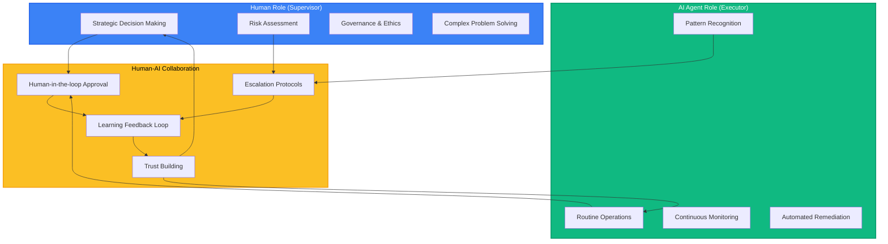

# Mermaid Diagrams for Agentic DevOps Presentation

## 1. Cognitive Overload vs. AI Processing Capacity

## 2. Traditional vs. Agentic AIOps Workflow

## 3. Cloud Provider Agentic AI Strategy

## 4. Netflix Autonomous Deployment Architecture

## 5. 90-Day Implementation Roadmap

## 6. ROI and Business Impact Flow

## 7. Human-AI Collaboration Model

These diagrams can be embedded directly into the presentation or used as reference materials for creating visual aids during the presentation.
